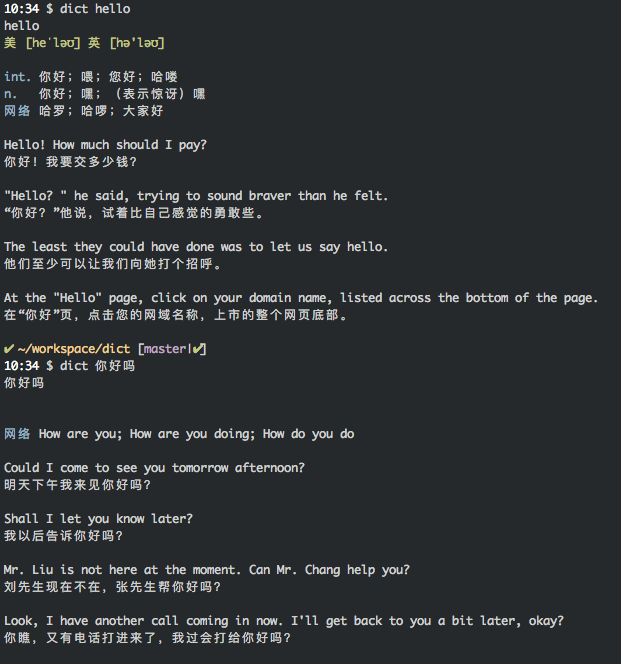

# BingDictionary

Here is a command line dictionary written with ruby that can
translate English to Chinese or vice versa.

It uses http://cn.bing.com/dict/ to query.

## Installation

    $ gem install bing_dictionary

## Usage
A `dict` runable bin file provided.

DEMO：

    $ dict cake
    $ dict 蛋糕

## Support long sentence
Now long sentence is supported

    $ dict 你好吗
    $ dict How old are you

## Support fuzzy query

    $ dict hexxo

    您要找的是不是

    音近词
    head coach总教练
    hexose己醣
    hexode六极管
    ...

## Support Chinese to English

    $ dict 单片机
    单片机

    网络 MCU; Single Chip Microcomputer; Microcontroller

    The monolithic integrated circuit occurs the explanation , did not understand may have a look !
    单片机发生的讲解，不懂得可以看看！
    ...

## Local cache supported
All queried word default cached to ~/.bing_dictionary.db.
So it's much faster when you query the word again.

[Here](https://github.com/first20hours/google-10000-english) have the most common English words.
You can cache them all with following script:

    curl https://raw.githubusercontent.com/first20hours/google-10000-english/master/google-10000-english-no-swears.txt | while read line; do dict $line; done

## More options

    $ dict --help
    Example: dict hello
        -p, --[no-]pronounce             Pronounce the word
        -c, --[no-]cache                 Use cache from ~/.bing_dictionary.db (Default on)
        -j, --jump                       Jump to web page
        -v, --version                    Show the version

## Work with vim
You can make it work tegother with Vim with [bing_dictionary.vim](https://github.com/lingceng/bing_dictionary.vim)

## Thanks
Heavily borrowed from [Command-Line-Youdao-Dictionary](https://github.com/qhwa/Command-Line-Youdao-Dictionary)

## Development

    bundle exec ./bin/dict --no-cache hello

## Contributing

Bug reports and pull requests are welcome on GitHub at https://github.com/lingceng/bing_dictionary. This project is intended to be a safe, welcoming space for collaboration, and contributors are expected to adhere to the [Contributor Covenant](http://contributor-covenant.org) code of conduct.

