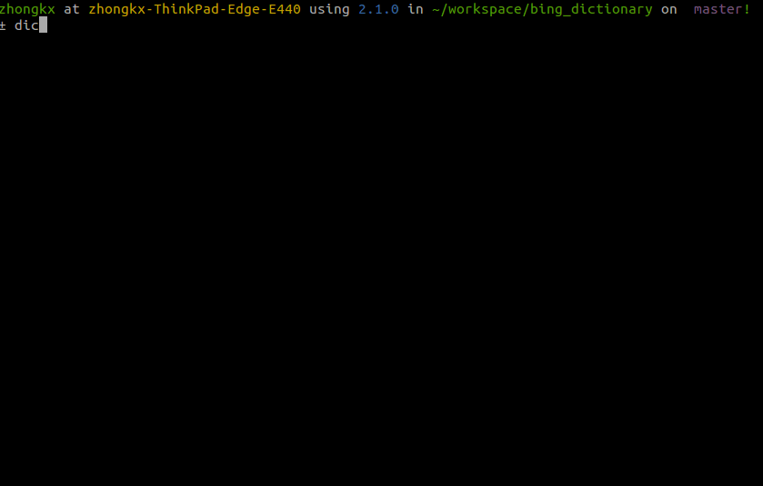

# Bing Command Dictionry

这是一个ruby脚本，用来在命令行中直接查询单词含义，免去打开软件或浏览器的麻烦。

Here is a command line dictionary written with ruby that can
translate English to Chinese.

Heavily borrowed from [Command-Line-Youdao-Dictionary](https://github.com/qhwa/Command-Line-Youdao-Dictionary)

## Usage

    ./dict <word>

DEMO：

    ./dict cake
    ./dict 蛋糕

You'd better add configuration to $HOME/.bashrc or $HOME/.profile to make alias

    alias d="/path/to/dict"

You can make it work tegother with Vim by add follows to $HOME/.vimrc

    nnoremap <leader>d :!dict <cword><CR>
    vnoremap <leader>d y:!dict <c-r>"<CR>

Or you can make it better if you use **neovim** or **Vimux**.

    if has('nvim')
      nnoremap <leader>d :botright 14split \| term dict <cword><CR>
      vnoremap <leader>d y:botright 14split \| term dict <c-r>"<CR>
    else
      if exists("*VimuxRunCommand")
        vnoremap <leader>d "vy:call VimuxRunCommand('dict ' . getreg('v'))<CR>
        nmap <leader>d viw<leader>d<CR>
      else
        nnoremap <leader>d :!dict <cword><CR>
        vnoremap <leader>d y:!dict <c-r>"<CR>
      end
    end

